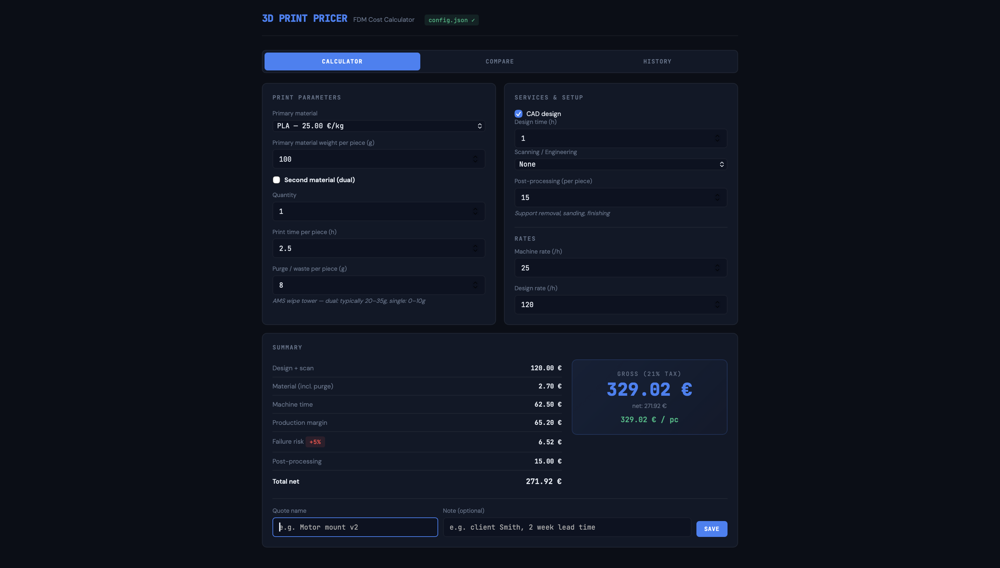
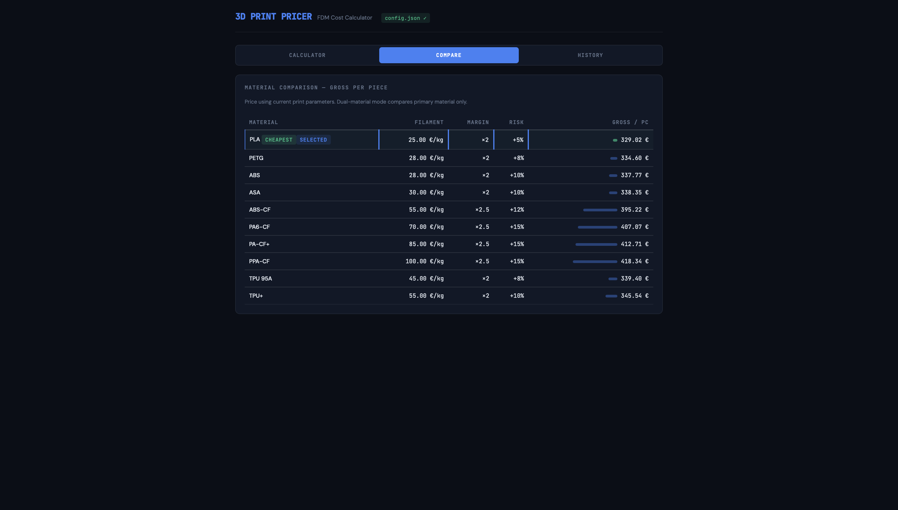
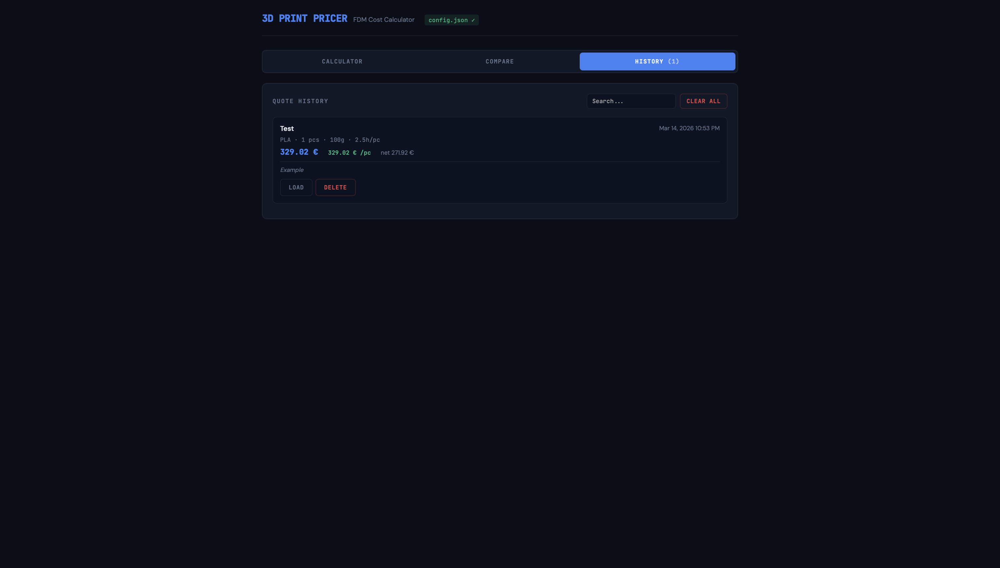

# 3D Print Pricing Calculator

A single-file, zero-dependency pricing calculator for 3D printing services. Built for Bambu Lab printers with AMS, but works for any FDM setup.

**[Live Demo →](https://gluhy.github.io/3d-print-pricer/)**

> You can configure the calculator directly in the live demo — tweak materials, rates, discounts, and currency — then use the **⬇ Download configured calculator** button in the Settings tab to save a standalone HTML file with your settings baked in. No server required, works fully offline.

| Calculator | Material Comparison | Quote History |
|---|---|---|
|  |  |  |

## Features

- **Dual-material support** — separate cost streams for two materials (e.g. ABS body + HIPS supports, PA-CF + TPU gasket), with automatic purge/waste splitting and elevated risk calculation for multi-material prints
- **Material comparison table** — enter parameters once, see price per piece across all materials side by side with visual bars
- **Quote history** — save quotes with names and notes, search, reload parameters, stored in localStorage
- **Full cost breakdown** — material, machine time, margin, failure risk, postprocessing, volume discounts, min price floor
- **Volume discounts** — configurable tiers (default: 5% at 10+, 7% at 20+, 10% at 50+ pcs)
- **AMS purge/waste tracking** — accounts for wipe tower waste per piece, auto-bumps on dual-material toggle
- **VAT calculation** — net + gross + per-piece gross pricing
- **Mobile responsive** — works on phone for on-the-go quoting

## Quick Start

**Option A — Local server** (needed for `config.json` to load):
```bash
# Python
python3 -m http.server 8000

# Node
npx serve .
```
Then open `http://localhost:8000`

**Option B — GitHub Pages:**
```bash
git clone https://github.com/Gluhy/3d-print-pricer
cd 3d-print-pricer
# Enable GitHub Pages in repo settings → Source: main branch
```

**Option C — Direct file open:**
Open `index.html` directly in your browser — it works without `config.json` using built-in defaults. A small badge in the header shows whether config was loaded.

> **Note:** Browsers block `fetch()` for `file://` URLs, so `config.json` won't load when opening `index.html` as a local file. The calculator falls back to defaults automatically. Use a local server or GitHub Pages to load your custom config.

## Customization

All configuration lives in **`config.json`** — no need to touch the HTML. The calculator loads it on startup and falls back to built-in defaults if the file is missing.

```jsonc
// config.json
{
  "currency": "€",
  "locale": "en-US",
  "tax_rate": 0.21,
  "min_net": 15,
  "dual_risk_bonus": 0.05,
  "machine_rate": 25,
  "design_rate": 120,
  "default_post_processing": 15,

  "discounts": [
    { "min": 50, "pct": 0.10, "label": "10%" },
    { "min": 20, "pct": 0.07, "label": "7%" },
    { "min": 10, "pct": 0.05, "label": "5%" }
  ],

  "scanning_options": [
    { "label": "None", "price": 0 },
    { "label": "3D scan — basic", "price": 150 }
  ],

  "materials": {
    "standard": [
      { "key": "pla", "name": "PLA", "price": 25, "margin": 2.0, "risk": 0.05 }
    ],
    "reinforced": [ ... ],
    "flexible": [ ... ],
    "support": [ ... ]
  }
}
```

Material dropdowns are built dynamically from `config.json` — prices appear next to each material name automatically. Group names (`standard`, `reinforced`, `flexible`, `support`) become `<optgroup>` labels. The `support` group only shows in the Material 2 dropdown.

### Config fields

| Field | Description |
|---|---|
| `currency` | Symbol shown after prices (`€`, `$`, `£`, `zł`) |
| `locale` | Number formatting locale (`en-US`, `de-DE`, `pl-PL`) |
| `tax_rate` | VAT / sales tax as decimal (`0.21` = 21%, `0` = none) |
| `min_net` | Floor price for any order (net) |
| `machine_rate` | Default machine hourly rate |
| `design_rate` | Default CAD design hourly rate |
| `dual_risk_bonus` | Extra failure risk added for dual-material prints |
| `materials.*.price` | Your filament cost per kg |
| `materials.*.margin` | Multiplier on base cost (`2.0` = 100% markup) |
| `materials.*.risk` | Failure surcharge (`0.10` = +10%) |

### How pricing works

```
Per piece:
  material_cost = (part_weight + purge_waste) / 1000 × price_per_kg
  machine_cost  = print_time × hourly_rate
  base          = material_cost + machine_cost
  with_margin   = base × margin_multiplier
  with_risk     = with_margin × (1 + risk_rate)

Total:
  production    = with_risk × quantity + postprocessing × quantity
  discount      = production × discount_rate
  net           = setup + production − discount
  gross         = net × (1 + TAX_RATE)
```

Key design decisions:
- **Margin applies to the full base** (material + machine), not just filament
- **Risk applies to production only**, not postprocessing (post happens regardless of print success)
- **Dual-material** uses the higher margin of the two materials, and adds a flat risk bonus on top of the higher risk
- **Purge waste** is split proportionally between materials by weight ratio
- **Volume discount** applies to production cost, not setup (CAD/scanning)

### Adding materials

Add a new entry to the appropriate group in `config.json`:

```json
{ "key": "pc", "name": "Polycarbonate", "price": 45, "margin": 2.5, "risk": 0.12 }
```

Or create a new group — it will appear as a new `<optgroup>` automatically:

```json
"high_temp": [
  { "key": "pei", "name": "PEI (ULTEM)", "price": 120, "margin": 3.0, "risk": 0.20 }
]
```

### Changing currency

Edit `config.json`:

```json
"currency": "$",
"locale": "en-US",
"tax_rate": 0.0
```

## Tech Stack

- Single HTML file + `config.json`
- Vanilla JS, no framework, no build step
- CSS custom properties for theming
- Google Fonts (JetBrains Mono + DM Sans) — works offline without them
- localStorage for quote history
- Falls back to built-in defaults if `config.json` is missing

## License

MIT — use it, fork it, sell prints with it.
